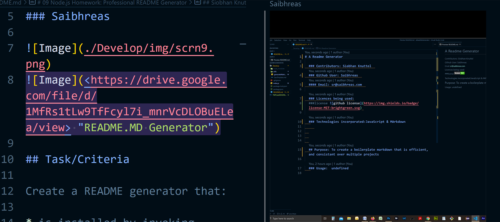

# A README Generator

## Contributors: Siobhan Knuttel
  
### Github User: Saibhreas
  
#### Email: sr@saibhreas.com

## Purpose: Create a README generator to offer consistant readme files over multiple projects.  To sere as minimum standard template
  
## Table of Content
  
    1. [Licence](###Licence)
    2. [Installation](###Instalation)
    3. [Usage](###Usage)
    4. [Technologies](###Technologies)
    5. [Description](##Description)
  
## Description: Uses none js command line prompts to populate readme file

### Licence: Apache

###license 
  
### Installation: From within integrated terminal: node index.js  
  
### Usage: Use to make efficeint consistant readme.md  
  
### Technologies: node js, Java Script, Markdown
  
### Images:

### Links: [Screencastify](https://drive.google.com/file/d/1MfRs1tLw9TfFcyl7i_mnrVcDLOBuELea/view") 