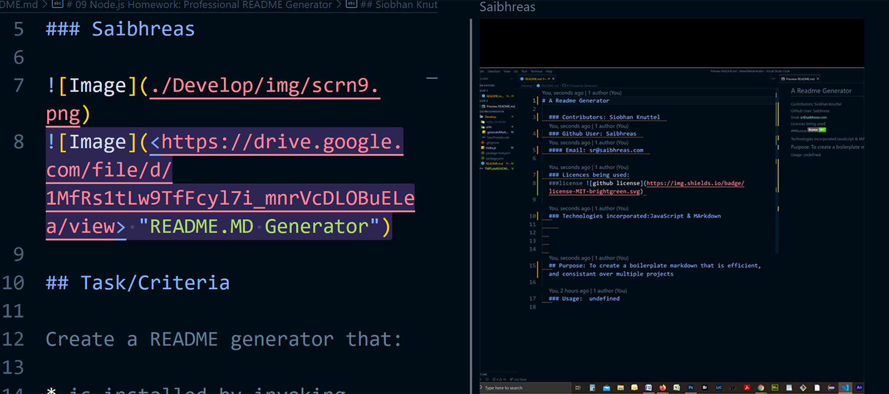

  
  
  

# 09 Node.js Homework: Professional README Generator

Github User: https://github.com/saibhreas

Email: fullstack@saibhreas.com

[Screencastify of readme being generated](https://drive.google.com/file/d/1MfRs1tLw9TfFcyl7i_mnrVcDLOBuELea/view)

## Purpose

Use Node JS to create a Command Line Interface (CLI) App that writes the initial format for a README.md file, a **ReadME File Generator**.  
App should be general enough for almost any app or modul.  App makes ReadMe.md files that demonstrate style, level of professionalism, readable, and informative.

The criteria were set by the Rutgers Fullstack program in assignment #9

## Table of Content
  
  1. [Description](#description)
  2. [Installation](#installation)
  3. [Usage](#usage)
  4. [Technologies](#technologies)
  5. [Question](#questions)
  
  
## Description

 Command Line Interface that creates a uniform boilerplate for a README.md file.  Allows for good minimum format that is consistent across projects, includes specific elements such as *Table of Contents* and more.

**Demonstrate grasp of use/concepts of:**
  * NPM
  * inquire-fs-selectors:
  * *fs-readFile*,  
  * *fs.writeFileSync*  
  * *inquirer.prompt*  
  * *require()*

### Task/Criteria

#### * Stipulated by Rutgers Fullstack program assignement 9

Create a README generator that:

* is installed by invoking integrated terminal and running:
  * node index.js

* command line accepts user input to create file sections:
  * Description
  * Table of contents:  
  * Links placed in table of contents that move to appropriate sections of the page  
  * Installation  
  * Usage information
  * Licence  
    * Choose a license from a list of options
    * Have a badge for the license displayed near the top of the README
  * Contribution guidelines
  * Tests
  * Questions:

## Installation

NPM init create package.json

npm install -g npm@8.12.2

Add Dependencies

  * npm install inquirer
  
    Inquire library used to handle CLI

## Usage

Free to read and fork. 

## Technologies

  * Node JS
